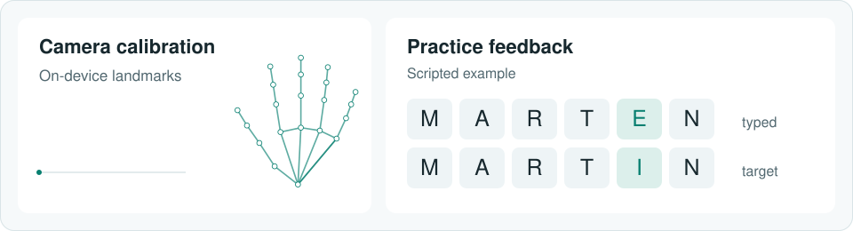
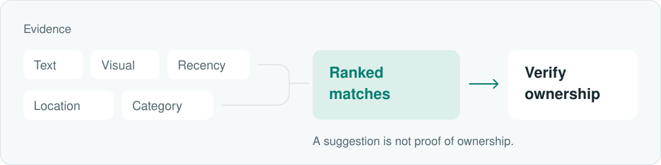

<picture>
  <source media="(prefers-color-scheme: dark) and (max-width: 600px)" srcset="./assets/hero-mobile-dark.svg">
  <source media="(max-width: 600px)" srcset="./assets/hero-mobile-light.svg">
  <source media="(prefers-color-scheme: dark)" srcset="./assets/hero-dark.svg">
  
</picture>

  <a href="mailto:bernard.w.freund@gmail.com">Email</a> &nbsp; / &nbsp;
  <a href="https://www.linkedin.com/in/bernard-freund-753b0b288/">LinkedIn</a> &nbsp; / &nbsp;
  <a href="https://github.com/BernardCode?tab=repositories">All repositories</a>

## Manua

I'm developing a browser-based fingerspelling practice app. Adaptive review helps learners revisit mistakes; teachers can manage classes and assignments.

<a href="https://manua-asl.vercel.app/demo">
  <picture>
    <source media="(prefers-color-scheme: dark) and (max-width: 600px)" srcset="./assets/manua-mobile-dark.svg">
    <source media="(max-width: 600px)" srcset="./assets/manua-mobile-light.svg">
    <source media="(prefers-color-scheme: dark)" srcset="./assets/manua-dark.svg">
    
  </picture>
</a>

[Explore the prototype ↗](https://manua-asl.vercel.app/demo)

Implementation & current limits

Next.js and TypeScript handle the application; Supabase handles authentication and data. MediaPipe processes camera frames locally for framing feedback. An approved letter classifier and signer recordings are still to come; the walkthrough contains no real learner data.

## LocatED

A school lost-and-found platform I co-built with Jerry Li, from item reports and search to claims and returns.

<picture>
  <source media="(prefers-color-scheme: dark) and (max-width: 600px)" srcset="./assets/located-mobile-dark.svg">
  <source media="(max-width: 600px)" srcset="./assets/located-mobile-light.svg">
  <source media="(prefers-color-scheme: dark)" srcset="./assets/located-dark.svg">
  
</picture>

Our team placed 2nd nationally in FBLA Website Coding &amp; Development. The school rollout is still pre-launch.

[Preview the interface ↗](https://locateed.vercel.app/)

Inside the matching pipeline

Postgres retrieves candidates; a TypeScript scoring layer blends the available signals. Campus locations use named zones and room refinements, so a report can say “near the gym” without needing GPS coordinates.

## Synthesis Hacks

I founded and led a free, 12-hour student hackathon at Google Humboldt in Sunnyvale on May 23, 2026. I worked on the event website and coordinated sponsors, volunteers, and logistics.

[Event & photos ↗](https://www.synthesishacks.com/) &nbsp; / &nbsp; [Website source](https://github.com/BernardCode/synthesis-hacks)

## Knok Lok

A knock-pattern prototype built with an ESP32 and a sound sensor. The C++ firmware compares intervals between knocks and signals whether the rhythm is accepted.

[Build & demo ↗](https://devpost.com/software/knok-lok) &nbsp; / &nbsp; [Firmware](https://github.com/DVeldhurthi/Knok_Lok/blob/main/Knok_Lok.ino)

---

Away from these builds: competitive programming, currently USACO Silver.

Manua and LocatED have private source. <a href="./docs/design.md">How this profile is built</a>.
